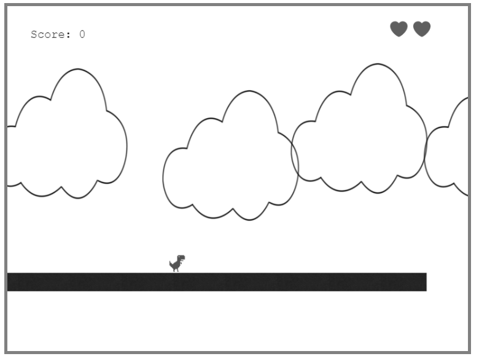

# platform-game

JavaScript Microverse Captsone Project By Oscar Russi

# What it does

- Platform game built with Phaser3

# Build with

- HTML5/CSS
- JavaScript
- Webpack
- Phaser3

# Live demo

[Live Demo](https://andresporras3423.github.io/todo-list/dist/index.html)

# How to run this project

- Download this project or install running the next command in the terminal: git clone https://github.com/andresporras3423/platform-game.git
- Move to the folder platform-game
- In the terminal, run: npm install
- In the terminal, run: npm run dev

# How to run the tests
- run the next command in the terminal: npm test

#### and deployed to GitHub

## Authors

**Oscar Russi**
- Github: [@andresporras3423](https://github.com/andresporras3423/)
- Linkedin: [Oscar Russi](https://www.linkedin.com/in/oscar-andres-russi-porras)

## � Contributing

This is a project for educational purposes only. We are not accepting contributions.

## Attributions and Credit

Special thanks to Microverse, for this learning opportunity. 

## Show your support

Give a ⭐️ if you like this project!

## Enjoy!